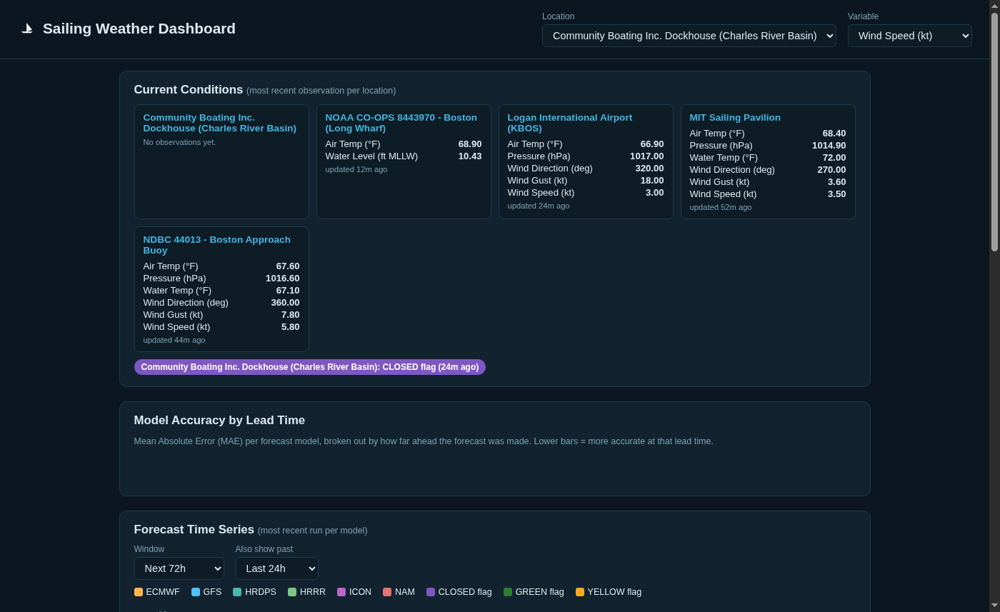
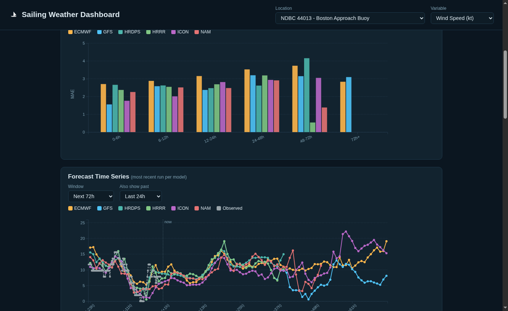
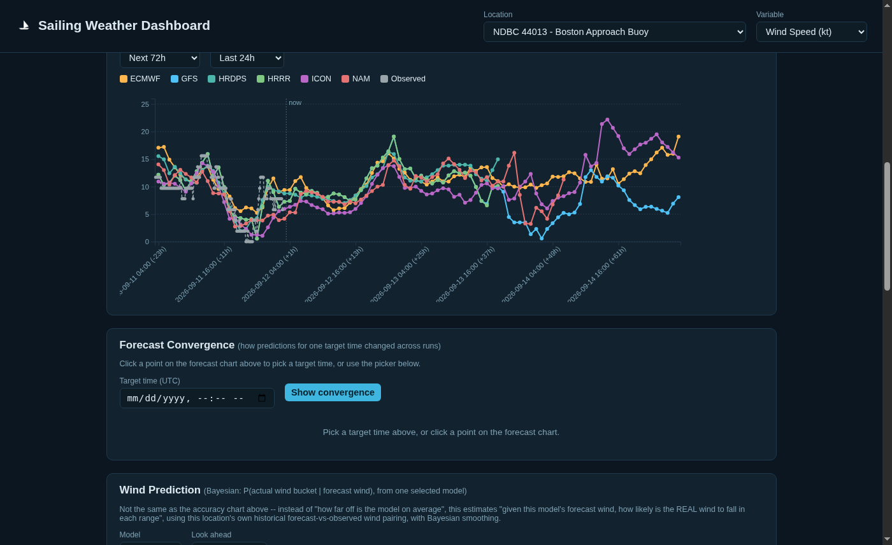
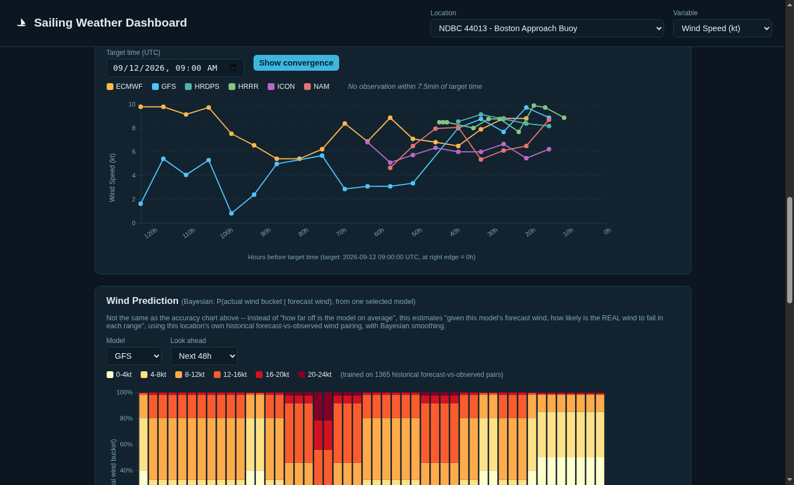
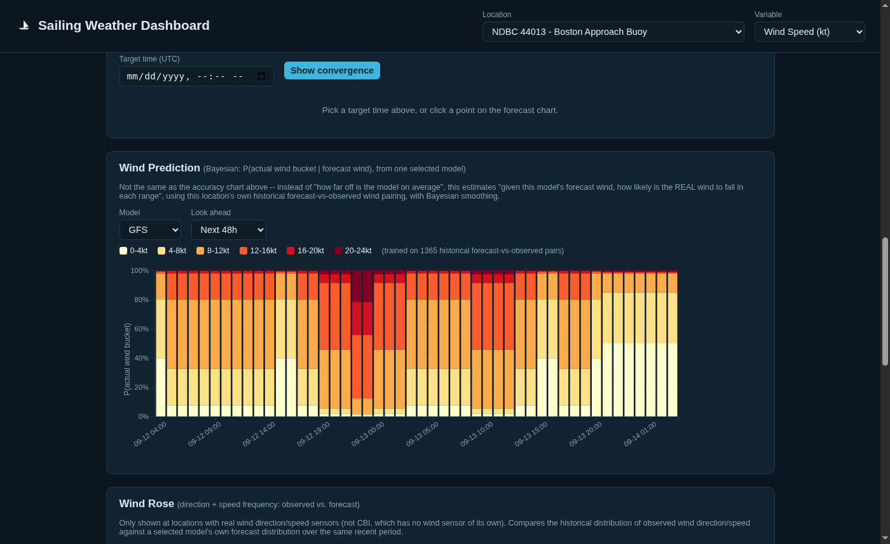
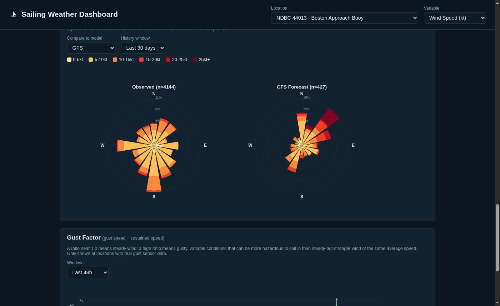
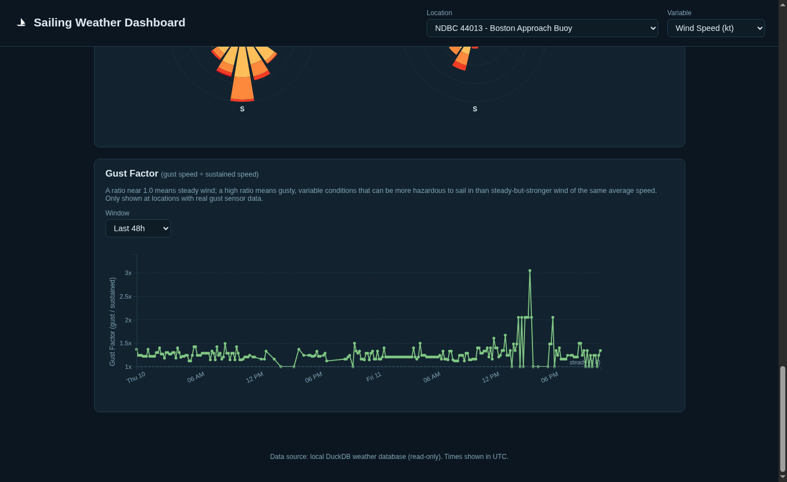
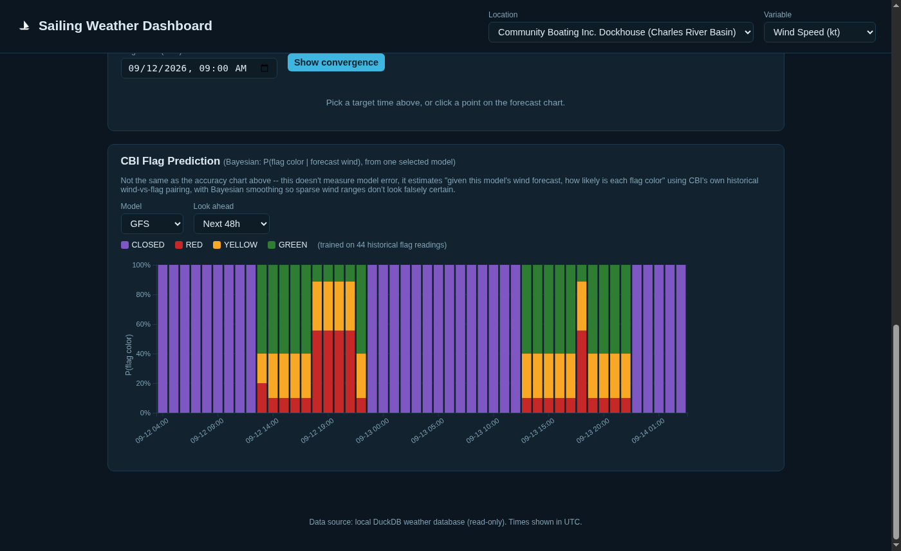

# Sailing Weather Dashboard (Boston Harbor / Charles River)

A personal weather system for sailing around Boston Harbor and the Charles
River basin: it ingests live observations and multi-model forecast data
into a local DuckDB database, tracks each model's forecast accuracy over
time, and serves a D3.js dashboard for planning a sail.

Built iteratively with an AI agent (Hermes) over a series of sessions —
the code, comments, and this README reflect that history (including a few
"found and fixed" bugs documented inline where they mattered).

## What it tracks

**Observations** (real sensor data):
- MIT Sailing Pavilion — wind speed/gust/direction, pressure, air & water temp
  (OCR'd from the station's own live day-graph images, since there's no
  public API)
- NDBC buoy 44013 (Boston Approach Buoy) — full marine weather feed
- NOAA CO-OPS Long Wharf (8443970) — water level (tide) + air temp
- Logan Airport (KBOS) — METAR
- Community Boating Inc. (CBI) dockhouse flag color (Green/Yellow/Red/Closed)
  — a human-set go/no-go signal, forced to "Closed" outside the venue's
  actual 9am–sunset operating hours

**Forecasts**, via [Open-Meteo](https://open-meteo.com/), across 6 models:
GFS, ECMWF, HRRR, ICON, NAM, HRDPS — refreshed every 4 hours, with each
model's own historical accuracy (MAE/RMSE by lead-time bucket) computed
live from real observation-vs-forecast matches, no cached snapshots.

## Screenshots

**Current conditions across every source, and the CBI flag status:**



**Model Accuracy by Lead Time** — MAE per model, broken out by how far
ahead the forecast was made:



**Forecast Time Series** — all 6 models plus the real observed line, with
hover-to-highlight and a "now" marker:



**Forecast Convergence** — pick any target time and see how each model's
prediction for that exact moment evolved across successive runs as the
target approached:



**Wind Prediction** (Bayesian) — not just "here's the forecast number," but
`P(actual wind bucket | model's forecast)`, learned from each location's
own historical forecast-vs-observed pairs:



**Wind Rose** — observed vs. forecast direction/speed distribution, side by
side:



**Gust Factor** — gust ÷ sustained wind speed over time; a ratio near 1.0
means steady wind, a spike means gusty/variable conditions that can be
more hazardous than steady-but-stronger wind of the same average speed:



**CBI Flag Prediction** (Bayesian, CBI only — the one location without a
wind sensor) — `P(flag color | forecast wind)`, correctly forced to
"Closed" outside real operating hours and never showing a "closed"
probability during them:



## Architecture

```
scripts/            ingestion scripts (one per data source), each a
                     standalone no_agent cron job:
  ingest_ndbc.py         NDBC buoy realtime2 feed
  ingest_coops.py        NOAA CO-OPS tide/temp API
  ingest_metar.py        Aviation Weather Center METAR
  ingest_mit_all.py      MIT Pavilion (5 graphs: wind, pressure,
                         air/water temp, wind direction — pixel-read via
                         OCR-calibrated axis scales, see mit_graph_ocr.py)
  ingest_flag.py         CBI dockhouse flag color (forced closed outside
                         9am-sunset via cbi_hours.py / astral)
  ingest_forecasts.py    Open-Meteo, 6 models x 5 locations

db/
  schema.sql         DuckDB schema + the live `v_accuracy_by_lead_time`
                     view (MAE/RMSE computed on read, no snapshot table)
  common.py          shared connection helper (UTC session timezone,
                     stale-lock detection for cron collisions)
  seed_locations.py  the 5 tracked locations (lat/lon/name)

website/
  app.py             stdlib-only HTTP server + JSON API (no framework;
                     every DB connection is read-only, never conflicts
                     with the ingestion cron jobs)
  static/            D3.js v7 frontend, plain JS (no build step)
```

## Running it

```bash
python3 db/seed_locations.py          # one-time: seed the 5 locations
python3 website/app.py                # dashboard on :8420 (PORT env var to override)
```

Each `scripts/ingest_*.py` is meant to run on its own schedule (cron):
buoy/tide/METAR every 15–60 min, MIT Pavilion + forecasts every 4 hours,
CBI flag hourly. See each script's docstring for specifics and rationale.

## Notable design decisions

- **Fahrenheit is the canonical temperature unit** project-wide.
- **No cached/derivative report tables** — accuracy, wind-rose, gust
  factor, and the Bayesian prediction panels are all computed live from
  `observations`/`forecast_values` on every request.
- **MIT Pavilion has no public data API**, so its 5 metrics are read by
  OCR-calibrating each day-graph's dynamic Y-axis (weewx auto-scales it
  per day) and pixel-scanning the plotted line/scatter — see
  `scripts/mit_graph_ocr.py` for the calibration approach and
  `scripts/ingest_mit_all.py` for extraction details, edge cases, and a
  couple of real bugs found and fixed along the way (axis-scale
  assumptions, stale-value locking, clipping detection).
- **CBI has no wind sensor** — its Bayesian "Flag Prediction" panel and
  training data use MIT Pavilion's wind observations as a proxy ground
  truth (same river basin, a few hundred meters away).
